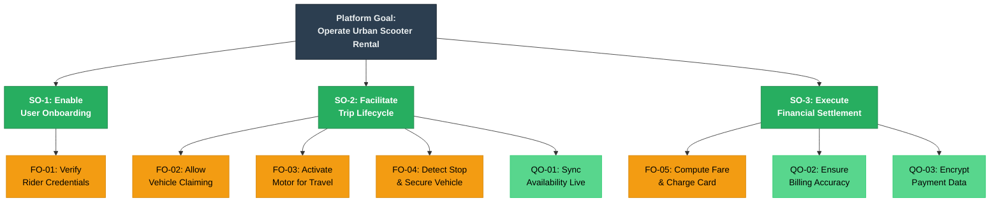

# Exercise 04 Solution: Urban Mobility E-Scooter Platform

**TU Clausthal**  
**Institute:** Software and Systems Engineering  
**Module:** Requirements Engineering  
**Assignment:** 04 – Agent-Oriented Modeling  
**Author:** Siddharth D. Patni (sp01)  
**Submission Date:** 11.01.2026

---

## 1. System Actors and Their Responsibilities

After analyzing the ride-share scenario, I identified three distinct actors that collaborate to deliver the service. Each actor plays a specific part in the overall workflow.

| Actor Type | Role Name | Core Responsibilities |
|------------|-----------|----------------------|
| End User (Human) | Rider | Initiates the rental journey: signs up, picks a vehicle, travels, and approves the charge |
| Physical Device (IoT) | Vehicle Controller | Governs hardware functions—motor engagement, GPS tracking, and availability broadcasting |
| Cloud Service (Software) | Billing Engine | Orchestrates account validation, duration tracking, fare determination, and fund transfer |

---

## 2. System Objectives

I structured the objectives into two categories: capabilities the platform must provide (functional) and performance standards it must meet (quality-focused).

### Functional Objectives

- **FO-01 (Onboarding):** New riders complete a signup flow where their credentials and card details undergo verification before activation.
- **FO-02 (Vehicle Claim):** Riders browse nearby vehicles via the app map, select one, and claim it—instantly marking it unavailable to others.
- **FO-03 (Trip Execution):** Once claimed, the vehicle motor activates, allowing the rider to travel freely until reaching their stop.
- **FO-04 (Trip Termination):** Parking the vehicle and tapping "End" triggers an automatic motor shutdown and GPS-based location update.
- **FO-05 (Automated Billing):** The platform computes travel charges and processes the transaction without requiring manual input.

### Quality Objectives

- **QO-01 (Live Inventory):** Vehicle availability reflects real-world status within seconds to prevent double-bookings.
- **QO-02 (Accurate Charges):** Fare calculations use server-recorded timestamps to ensure riders pay exactly what they owe.
- **QO-03 (Data Protection):** Sensitive payment credentials remain encrypted and are accessed only during the debit operation.

### Objective Hierarchy (3 Tiers)

The diagram below illustrates how the main platform goal decomposes into sub-objectives and finally into specific leaf-level tasks:

**Color Key:**
- 🔵 **Tier 1:** Overall platform mission
- 🟢 **Tier 2:** Major capability areas
- 🟡 **Tier 3 (Gold):** Functional leaf objectives
- 🟢 **Tier 3 (Mint):** Quality leaf objectives

---

## 3. Fare Calculation Logic

I chose a **duration-based pricing model** since the assignment allows flexibility in formula design.

### Pricing Formula

$$\text{TripCost} = \text{StartFee} + (\text{Minutes} \times \text{PerMinuteRate})$$

**Component Breakdown:**

| Component | Meaning | Sample Value |
|-----------|---------|--------------|
| StartFee | One-time unlock charge | €1.00 |
| Minutes | Elapsed time from unlock to lock | Variable |
| PerMinuteRate | Ongoing usage charge | €0.20 |

**Calculation Example:**  
A 12-minute trip costs: €1.00 + (12 × €0.20) = **€3.40**

---

## 4. Behavioral Interface Model (BIM)

The state diagram below traces a complete rental session, showing how control passes between the three roles.

### Workflow Narrative

1. **Account Setup:** A first-time user registers and provides payment information
2. **Vehicle Selection:** The rider claims an available scooter through the app
3. **Travel Phase:** Vehicle Controller unlocks the motor; rider travels
4. **Session Close:** Rider ends the trip; Vehicle Controller locks hardware
5. **Settlement:** Billing Engine calculates duration-based fare and charges the card

### State Flow Diagram

---

## Closing Remarks

This solution models a real-world urban mobility scenario using agent-oriented principles. The three-role decomposition mirrors how actual ride-share platforms separate user interfaces, IoT device management, and financial backends. The time-based billing formula keeps the model simple while remaining practical.
