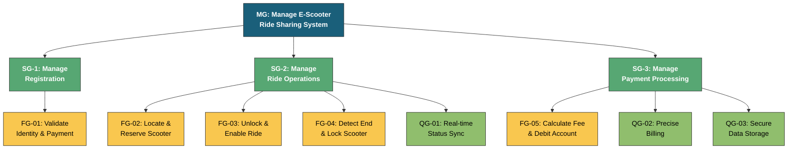
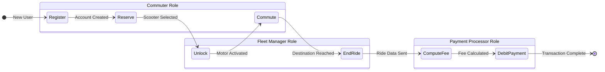

# Solution for Exercise 04: E-Scooter Ride-Share System

**TU Clausthal**  
**Department:** Institut für Software and Systems Engineering  
**Course:** Requirements Engineering  
**Exercise:** 04 (Agent-Oriented Modeling)  
**Submitted By:** Siddharth D. Patni (sp01)  
**Date:** 11.01.2026

---

## 1. Agents and Roles

Based on the project scenario, the system involves the interaction between the commuter, the physical scooter, and the backend service. The following Agents and Roles have been identified.

| Agent | Assigned Role | Description |
|-------|--------------|-------------|
| Commuter (Human) | Commuter Role | Responsible for the user-side process: registering, reserving the scooter, riding safely, and authorizing payment. |
| E-Scooter (Hardware) | Fleet Manager Role | Handles the physical state of the vehicle (locking/unlocking) and reports real-time status (Idle/Reserved) and location. |
| Backend System (Software) | Payment Processor Role | Manages the logic for account verification, fee computation, and secure financial debiting. |

---

## 2. Goals

The system goals are categorized into **Functional Goals** (what the system does) and **Quality Goals** (how the system performs).

### Functional Goals (FG)

- **FG-01 (Registration):** The system shall allow new commuters to register by validating their personal identity and payment details.
- **FG-02 (Reservation):** The Commuter shall be able to locate an idle scooter and reserve it, changing its status to prevent other users from booking it.
- **FG-03 (Commute):** The Commuter shall be able to unlock the specific scooter and ride to their destination.
- **FG-04 (End Ride):** The system shall detect when the user terminates the ride and immediately lock the scooter.
- **FG-05 (Payment):** The system shall automatically calculate the final fee and debit the registered payment method without manual intervention.

### Quality Goals (QG)

- **QG-01 (Data Accuracy):** The status of all scooters (Idle vs. Reserved) must be updated in real-time to avoid synchronization errors.
- **QG-02 (Billing Precision):** The ride fee calculation must be mathematically precise based on the exact duration recorded by the backend.
- **QG-03 (Security):** Commuter payment details must be stored securely and only accessed during the automatic debit process.

### Goal Hierarchy Diagram (3-Level Tree)

The following diagram shows the hierarchical decomposition of goals with at least 3 levels as required:

**Diagram Legend:**
- 🔵 **Level 1 (Blue):** Main System Goal
- 🟢 **Level 2 (Green):** Sub-Goals (Registration, Ride Operations, Payment)
- 🟡 **Level 3 - Yellow:** Functional Leaf Goals (FG-01 to FG-05)
- 🟢 **Level 3 - Light Green:** Quality Leaf Goals (QG-01 to QG-03)

## 3. Ride Cost Computation

The system implements a **Time-Based pricing strategy**.

### Formula:

$$TotalFee = UnlockFee + (Duration_{minutes} \times Rate_{min})$$

**Where:**
- **UnlockFee:** A fixed starting fee (e.g., €1.00).
- **Duration:** Time difference between Unlock and End Ride timestamps (rounded up).
- **Rate:** The per-minute usage cost (e.g., €0.20).

---

## 4. AOM Behavioral Interface Model (BIM)

The Behavioral Interface Model (BIM) below illustrates the dynamic interaction between roles. It is consistent with the Leaf Goals defined in the Goal Model.

### Process Description:

1. **Registration/Reservation:** The process starts with the Commuter creating an account or reserving an existing Idle scooter.
2. **Unlock:** Upon successful reservation, the Fleet Manager unlocks the hardware.
3. **Commute:** The Commuter uses the vehicle.
4. **End Ride:** The user ends the session, prompting the Fleet Manager to lock the device.
5. **Payment:** The Payment Processor calculates the fee based on the duration and debits the account.

### State Diagram:

---

## Summary

This solution presents a comprehensive Agent-Oriented Model for an E-Scooter Ride-Share System, defining:
- Three primary agents with distinct roles (Commuter, Fleet Manager, Payment Processor)
- Functional and quality goals ensuring system effectiveness and reliability
- A transparent time-based pricing model
- A behavioral interface model illustrating the complete ride lifecycle

The design emphasizes real-time status synchronization, secure payment processing, and precise billing to ensure a seamless user experience.
