# Exercise 04 Solution: E-Scooter Rental Platform

**TU Clausthal** | Institut für Software and Systems Engineering  
**Course:** Requirements Engineering | **Exercise:** 04 (Agent-Oriented Modeling)  
**Submitted By:** Nikunj | **Date:** 11.01.2026

---

## 1. System Actors Identification

The E-Scooter rental platform involves three distinct system actors with clearly defined responsibilities:

| Actor | Assigned Role | Key Responsibilities |
|-------|---------------|---------------------|
| Rider (Human Actor) | Customer Service Role | Account setup, vehicle selection, trip execution, payment confirmation |
| Smart Vehicle (IoT Device) | Vehicle Controller Role | Motor operation, GPS tracking, battery monitoring, lock mechanism control |
| Cloud Platform (Software System) | Transaction Manager Role | User authentication, fare calculation, payment gateway integration, analytics |

---

## 2. Architectural Justification

### Actor Separation Principle

The three-actor architecture was selected based on **responsibility isolation**:

1. **Rider Actor:** External user with autonomous decision-making capability. The system must accommodate varying user preferences and behaviors.

2. **Smart Vehicle Actor:** IoT devices operate under network latency constraints and require independent state management for safety-critical operations like emergency braking.

3. **Cloud Platform Actor:** Centralized processing enables cross-device coordination, historical data analysis, and scalable transaction handling.

**Rejected Alternative:** A monolithic two-actor design would couple hardware control with business logic, creating deployment and maintenance challenges.

### Distance-Based Pricing Rationale

**Distance-based pricing** was implemented for the following reasons:

1. **Usage Fairness:** Users pay proportionally to actual vehicle wear and energy consumption
2. **Incentive Alignment:** Encourages efficient route planning
3. **Market Differentiation:** Distinct from competitors using time-based models

**Mitigation:** Minimum fare threshold prevents micro-trip exploitation.

---

## 3. System Objectives

### Operational Objectives

| Code | Objective | Implementation Scope |
|------|-----------|---------------------|
| **OP-01** | User Onboarding | Enable account creation with license verification and wallet setup |
| **OP-02** | Vehicle Discovery | Provide map-based search for nearby available vehicles |
| **OP-03** | Trip Activation | Allow QR code scanning to initiate ride session |
| **OP-04** | Trip Termination | Support manual end-ride action or geofence-triggered completion |
| **OP-05** | Billing Execution | Process automated fare deduction post-trip |

### Performance Objectives

| Code | Objective | Acceptance Criteria |
|------|-----------|---------------------|
| **PF-01** | System Responsiveness | Vehicle unlock within 3 seconds of request |
| **PF-02** | Fare Accuracy | Distance calculation error margin < 2% |
| **PF-03** | Data Protection | PCI-DSS compliant payment storage |

---

## 4. Objective Decomposition Model

The objective hierarchy follows a **balanced three-tier structure**:

- **Tier 1:** Strategic Objective – Operate E-Scooter Rental Service
- **Tier 2:** Tactical Objectives:
  - TO-A: Handle User Lifecycle Management
  - TO-B: Manage Vehicle Fleet Operations
  - TO-C: Execute Financial Transactions
  - TO-D: Ensure Platform Reliability
- **Tier 3:** Operational Objectives (5) + Performance Objectives (3)

**Structural Decision:** Separating Fleet Operations (TO-B) from Financial Processing (TO-C) enables independent scaling of hardware management and payment processing subsystems.

```mermaid
graph TB
    subgraph "Tier 1 - Strategic"
        SO["📊 Operate E-Scooter Rental Service"]
    end
    
    subgraph "Tier 2 - Tactical"
        TOA["👤 TO-A: User Lifecycle"]
        TOB["🛴 TO-B: Fleet Operations"]
        TOC["💰 TO-C: Financial Transactions"]
        TOD["🔒 TO-D: Platform Reliability"]
    end
    
    subgraph "Tier 3 - Operational"
        OP1["OP-01: User Onboarding"]
        OP2["OP-02: Vehicle Discovery"]
        OP3["OP-03: Trip Activation"]
        OP4["OP-04: Trip Termination"]
        OP5["OP-05: Billing Execution"]
    end
    
    subgraph "Tier 3 - Performance"
        PF1["PF-01: Responsiveness"]
        PF2["PF-02: Fare Accuracy"]
        PF3["PF-03: Data Protection"]
    end
    
    SO --> TOA
    SO --> TOB
    SO --> TOC
    SO --> TOD
    
    TOA --> OP1
    TOA --> PF3
    
    TOB --> OP2
    TOB --> OP3
    TOB --> OP4
    TOB --> PF1
    
    TOC --> OP5
    TOC --> PF2
    
    TOD --> PF1
    TOD --> PF3
    
    style SO fill:#1565c0,stroke:#0d47a1,color:#fff
    style TOA fill:#2e7d32,stroke:#1b5e20,color:#fff
    style TOB fill:#2e7d32,stroke:#1b5e20,color:#fff
    style TOC fill:#2e7d32,stroke:#1b5e20,color:#fff
    style TOD fill:#2e7d32,stroke:#1b5e20,color:#fff
    style OP1 fill:#f9a825,stroke:#f57f17
    style OP2 fill:#f9a825,stroke:#f57f17
    style OP3 fill:#f9a825,stroke:#f57f17
    style OP4 fill:#f9a825,stroke:#f57f17
    style OP5 fill:#f9a825,stroke:#f57f17
    style PF1 fill:#7b1fa2,stroke:#4a148c,color:#fff
    style PF2 fill:#7b1fa2,stroke:#4a148c,color:#fff
    style PF3 fill:#7b1fa2,stroke:#4a148c,color:#fff
```



---

## 5. Fare Calculation Model

The platform implements a **distance-based pricing structure**:

```
TripFare = BaseFee + (DistanceKm × RatePerKm) + SurchargeFees
```

### Pricing Parameters

| Parameter | Description | Default Value |
|-----------|-------------|---------------|
| BaseFee | Initial activation charge | €0.50 |
| DistanceKm | Trip distance via GPS tracking | Variable |
| RatePerKm | Per-kilometer usage rate | €0.25 |
| SurchargeFees | Peak hours, low battery zones | €0.00 - €1.00 |

**Sample Calculation:**  
A 6 km trip during peak hours:  
€0.50 + (6 × €0.25) + €0.50 = **€2.50**

---

## 6. Interaction Flow Specification

The interaction model captures the complete rental workflow with exception handling:

### Standard Workflow

1. **Onboard** → Rider creates verified account
2. **Discover** → Rider locates nearby vehicle via app
3. **Activate** → Rider scans QR to unlock vehicle
4. **Travel** → Rider completes journey
5. **Terminate** → Rider parks and ends session
6. **Settle** → Platform calculates and deducts fare

### Exception Scenarios

| Exception | Trigger Condition | Resolution Strategy |
|-----------|------------------|---------------------|
| **ActivationFailure** | Vehicle hardware malfunction | Reassign alternative vehicle, no charge |
| **TransactionDeclined** | Payment method rejected | Prompt card update, temporary suspension after 48h |
| **GeofenceViolation** | Vehicle exits permitted zone | Audio warning + automatic speed reduction |


---

## 7. Model Validation

### Completeness Check

- ✅ All actors identified with distinct responsibilities
- ✅ Operational and performance objectives defined
- ✅ Pricing model specified with example calculation
- ✅ Happy path and exception flows documented
- ✅ State diagram covers all transitions

### Traceability Matrix

| Objective | Actor Responsible | Workflow Step |
|-----------|------------------|---------------|
| OP-01 | Cloud Platform | Onboard |
| OP-02 | Cloud Platform, Smart Vehicle | Discover |
| OP-03 | Smart Vehicle | Activate |
| OP-04 | Rider, Smart Vehicle | Terminate |
| OP-05 | Cloud Platform | Settle |

---

## 8. Conclusion

This AOM solution provides a comprehensive model for the E-Scooter rental platform using distance-based pricing and robust exception handling. The three-tier objective hierarchy enables clear responsibility allocation while maintaining operational flexibility for future enhancements.