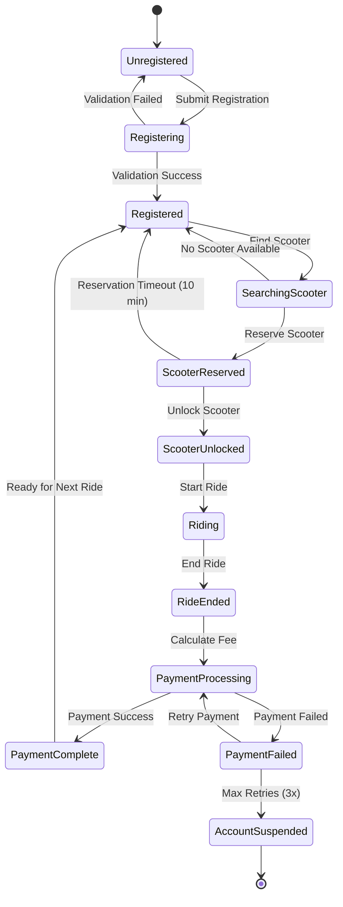
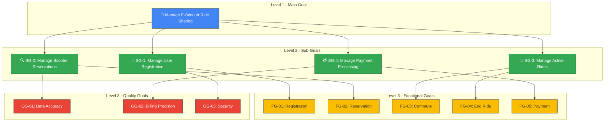

# Solution for Exercise 04: E-Scooter Ride-Share System

**TU Clausthal** | Institut für Software and Systems Engineering  
**Course:** Requirements Engineering | **Exercise:** 04 (Agent-Oriented Modeling)  
**Submitted By:** Nikunj | **Date:** 11.01.2026

---

## 1. Agents and Roles

| Agent | Role | Description |
|-------|------|-------------|
| Commuter (Human) | Commuter Role | Handles user-side processes: registration, scooter reservation, riding, and payment authorization |
| E-Scooter (Hardware) | Fleet Manager Role | Controls physical vehicle state (lock/unlock), reports real-time status and GPS location |
| Backend System (Software) | Payment Processor Role | Manages account verification, fee computation, and secure financial transactions |

---

## 2. Design Rationale

### Three-Agent Decomposition
Separating human (Commuter), hardware (E-Scooter), and software (Backend) agents follows the *separation of concerns* principle, enabling independent development and deployment of each system component.

### Time-Based Pricing Choice
Selected over distance-based due to:
1. User comprehension simplicity
2. Hardware reliability (GPS accuracy issues)
3. Fairness (prevents gaming via circular routes)

---

## 3. Goals

### Functional Goals

| ID | Goal | Description |
|----|------|-------------|
| FG-01 | Registration | Allow new commuters to register with identity and payment validation |
| FG-02 | Reservation | Enable locating and reserving idle scooters |
| FG-03 | Commute | Allow unlocking and riding the reserved scooter |
| FG-04 | End Ride | Detect ride termination and lock scooter automatically |
| FG-05 | Payment | Calculate and debit fees without manual intervention |

### Quality Goals

| ID | Goal | Description |
|----|------|-------------|
| QG-01 | Data Accuracy | Real-time scooter status synchronization |
| QG-02 | Billing Precision | Accurate fee calculation based on exact duration |
| QG-03 | Security | Encrypted storage of payment credentials |

---

## 4. Ride Cost Computation

### Formula

```
TotalFee = UnlockFee + (Duration_minutes × Rate_per_min)
```

### Variables

| Variable | Description | Example Value |
|----------|-------------|---------------|
| UnlockFee | Fixed starting fee | €1.00 |
| Duration | Time from unlock to end ride (rounded up) | 15 minutes |
| Rate | Per-minute usage charge | €0.20 |

**Example:** A 15-minute ride costs €1.00 + (15 × €0.20) = **€4.00**

---

## 5. Behavioral Interface Model (BIM)

The BIM illustrates the complete interaction workflow, **including error recovery paths**.

### Happy Path

1. Registration → Account creation
2. Reservation → Scooter selection
3. Unlock → Motor activation
4. Commute → Travel period
5. End Ride → Vehicle lock
6. Payment → Fee deduction

### Error Handling

| Error State | Trigger | Recovery |
|-------------|---------|----------|
| ReservationTimeout | User doesn't unlock within 10 min | Scooter released, no charge |
| PaymentFailed | Insufficient funds / card declined | Retry (max 3×) → Suspension |

### BIM State Diagram



---

## 6. Goal Hierarchy Diagram (Enhanced 4-Level Model)

The goal hierarchy has been **rebalanced** to distribute complexity evenly:

- **Level 1 (Blue):** Main Goal – Manage E-Scooter Ride Sharing
- **Level 2 (Green):** Four Sub-Goals:
  - SG-1: Manage User Registration
  - SG-2: Manage Scooter Reservations
  - SG-3: Manage Active Rides
  - SG-4: Manage Payment Processing
- **Level 3 (Yellow/Light Green):** Leaf Goals (5 Functional + 3 Quality)

### Hierarchy Balance
Splitting "Ride Operations" into Reservations (SG-2) and Active Rides (SG-3) creates clearer separation of concerns and prevents one sub-goal from dominating the model.

### Goal Hierarchy Diagram



---

## Summary

This solution provides a comprehensive Agent-Oriented Model for the E-Scooter Ride-Share System, covering:

1. **Agent identification** with clear role separation
2. **Goal decomposition** into functional and quality goals
3. **Cost computation** with transparent pricing formula
4. **Behavioral modeling** with state diagrams including error handling
5. **Goal hierarchy** with balanced 4-level structure