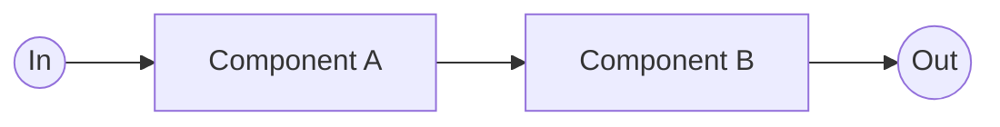
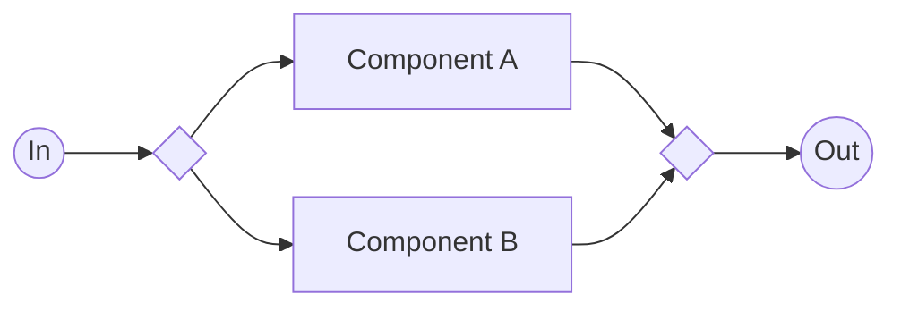
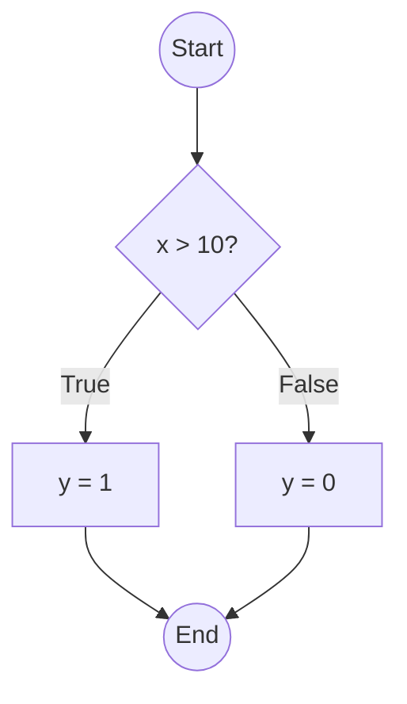
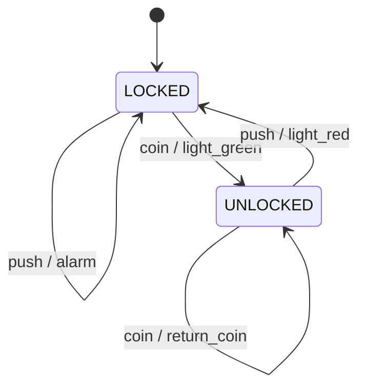
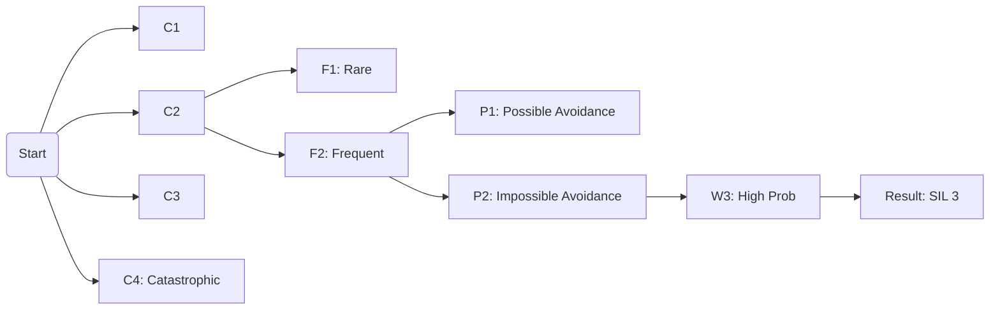

# Complete Exam Guide: Software for Safety-critical Autonomic Systems (SsaS)

This document consolidates all theory, mathematical formulas, practical coding tips, and visual diagrams into a single study resource.

---

## 1. Technical Reliability & Mathematical Foundations

### 1.1 Fundamental Definitions

- **Reliability ($R(t)$)**: Probability that a system performs its function under stated conditions for time $t$.
- **Unreliability / Failure Probability ($F(t)$)**: Probability that the system fails before time $t$.

$$F(t) = 1 - R(t)$$

- **Failure Rate ($\lambda$)**: Frequency of failures (usually in $h^{-1}$).
- **MTTF (Mean Time To Failure)**: Expected time to first failure (non-repairable systems).
- **MTBF (Mean Time Between Failures)**: Expected time between failures (repairable).

$$MTBF = MTTF + MTTR$$

- **Availability ($A$)**: Probability that a system is operational at any random time.

$$A = \frac{\mu}{\mu + \lambda} = \frac{MTBF}{MTBF + MTTR}$$

*(Where $\mu = 1/MTTR$ is the repair rate)*

### 1.2 Mathematical Functions (Exponential Distribution)

For electronic components with a constant failure rate $\lambda$:

| Function | Formula | Notes |
| :--- | :--- | :--- |
| Reliability | $R(t) = e^{-\lambda t}$ | Decays over time |
| Failure Prob. | $F(t) = 1 - e^{-\lambda t}$ | Grows over time |
| PDF | $f(t) = \lambda e^{-\lambda t}$ | Probability Density Function |
| MTTF | $MTTF = \frac{1}{\lambda}$ | Inverse of failure rate |

### 1.3 Reliability Block Diagrams (RBD) Calculation

#### Serial System (1oo2 Failure / AND Logic for Success)

- **Logic**: All components must work. If one fails, system fails.
- **Reliability**: $R_{sys} = \prod_{i=1}^{n} R_i = R_1 \cdot R_2 \cdot ...$
- **Failure Rate**: $\lambda_{sys} = \sum \lambda_i$

#### Parallel System (1oo2 Success / OR Logic for Success)

- **Logic**: Only one component needs to work (Redundancy).
- **Unreliability**: $F_{sys} = F_1 \cdot F_2$
- **Reliability**: $R_{sys} = 1 - F_{sys} = 1 - [(1-R_1) \cdot (1-R_2)]$

#### k-out-of-n Systems (Voting)

- **Example**: 2oo3 (2 out of 3 must work).
- **Formula (Identical Components)**:

$$R_{2oo3} = 3R^2 - 2R^3$$

---

## 2. Functional Safety (ISO 61508)

### 2.1 SIL and Risk Graph

**Risk = Frequency × Consequence.**

The ISO 61508 Risk Graph determines the **SIL (Safety Integrity Level)** based on:

- **C (Consequence)**: C1 (Minor) to C4 (Catastrophic/Death).
- **F (Frequency)**: F1 (Rare) to F2 (Frequent).
- **P (Possibility of Avoidance)**: P1 (Possible) to P2 (Impossible).
- **W (Probability of unwanted occurrence)**: W1 (Slight) to W3 (High).

### 2.2 Hardware Fault Tolerance (HFT)

**HFT = N**: The system can continue safely with $N$ faults.

| Architecture | HFT | Description |
| :--- | :--- | :--- |
| 1oo1 | 0 | 0 faults tolerated |
| 1oo2 | 1 | 1 fault tolerated |
| 2oo3 | 1 | Tolerates 1 fault; needs 2 working |

### 2.3 Probability of Failure on Demand (PFD)

Used for **Low Demand Mode** systems (e.g., airbags).

- $\lambda_{DU}$: Dangerous Undetected failure rate.
- $T_1$: Proof Test Interval (Maintenance interval).

**Key Exam Formulas (Approximations):**

#### 1. 1oo1 Architecture (Single Channel)

$$PFD_{avg} \approx \lambda_{DU} \cdot \frac{T_1}{2}$$

#### 2. 1oo2 Architecture (Redundant)

$$PFD_{avg} \approx \frac{(\lambda_{DU} \cdot T_1)^2}{3}$$

*(Note: If components are different, calculate $PFD_1$ and $PFD_2$ separately and multiply them).*

---

## 3. Software Testing & Coverage

### 3.1 Coverage Metrics

- **Statement Coverage (C0)**: Every line executed.
- **Branch Coverage (C1)**: Every decision (if/else) taken both True and False.
- **Condition Coverage**: Every atomic condition (A, B in `if A or B`) evaluates to True and False.
- **MC/DC (Modified Condition/Decision Coverage)**: Mandatory for SIL 3. Every condition must independently affect the decision outcome.

### 3.2 MC/DC Strategy (Truth Tables)

To prove independence for variable A in `if (A or B)`:

**Find two test cases where only A changes, B remains constant, and the Result changes.**

**Example Table for `A or B`:**

| Test Case | A | B | Result | Independence Check |
| :--- | :--- | :--- | :--- | :--- |
| 1 | False | False | False | |
| 2 | True | False | True | Pair (1,2): A flips, B stays False, Result flips. **Proves A.** |
| 3 | False | True | True | Pair (1,3): B flips, A stays False, Result flips. **Proves B.** |

---

## 4. Formal Verification & CTL

### 4.1 State Machines

- **Mealy Machine**: Output depends on State AND Input.
- **Moore Machine**: Output depends ONLY on State.

### 4.2 Computational Tree Logic (CTL)

Used to verify safety properties.

**Path Quantifiers:**
- **A** = All paths (inevitable).
- **E** = Exists a path (possible).

**Temporal Operators:**
- **G** = Globally (Always).
- **F** = Future (Eventually).
- **X** = Next state.

**Common Exam Translations:**

| Statement | CTL Formula |
| :--- | :--- |
| "The system must never crash." | $AG(\neg \text{Crash})$ |
| "If Error occurs, we must eventually reach Stop." | $AG(\text{Error} \to AF(\text{Stop}))$ |
| "It is possible to reset the system." | $EF(\text{Reset})$ |

---

## 5. Practical Coding (C for Safety)

### 5.1 State Machine Implementation Pattern

**Standard Exam Pattern:**

```c
#define STATE_IDLE 0
#define STATE_RUN  1

void update_state(int input) {
    static int state = STATE_IDLE; // Remember state between calls
    
    switch (state) {
        case STATE_IDLE:
            if (input == 1) {
                state = STATE_RUN;
                // Set outputs here
            }
            break;
        case STATE_RUN:
            if (input == 0) {
                state = STATE_IDLE;
            }
            break;
        default:
            // Safe state handling (MISRA requirement)
            state = STATE_IDLE; 
            break;
    }
}
```

### 5.2 Bitwise Operations

Often asked for register manipulation.

| Operation | Code |
| :--- | :--- |
| Set Bit 3 | `Reg \|= (1 << 3);` |
| Clear Bit 3 | `Reg &= ~(1 << 3);` |
| Check Bit 3 | `if (Reg & (1 << 3))` |

---

## 6. Visual Diagrams (Exam Reference)

### 6.1 Reliability Block Diagrams (RBD)

#### Serial System (1oo2 Failure / AND Success)

**Requirement**: Both A and B must function.



**Math**: $R_{sys} = R_A \times R_B$

#### Parallel System (1oo2 Success / OR Success)

**Requirement**: Either A or B must function.



**Math**: $R_{sys} = 1 - (1-R_A)(1-R_B)$

### 6.2 Control Flow Graph (CFG)

Used to visualize branches for coverage.

**Code:**
```c
if (x > 10) { y = 1; } 
else { y = 0; }
return y;
```

**Diagram:**



### 6.3 State Machine Example (Turnstile)

**States**: LOCKED, UNLOCKED.
**Transitions**: Coin (Unlock), Push (Lock).



### 6.4 Risk Graph Structure (ISO 61508)

Flow for determining SIL Level:



---

## 7. Exam Checklist

- ✅ **Calculator**: Essential for PFD and Reliability calculations.
- ✅ **Decimals**: Calculate to 5 decimal places if asked.
- ✅ **Justification**: Always explain *why* a coverage metric (like MC/DC) is chosen (e.g., "Because it proves independence of conditions, required for SIL 3").
- ✅ **MISRA**: Look for infinite loops, missing `default` cases, or dynamic memory (`malloc`) in code review questions.
