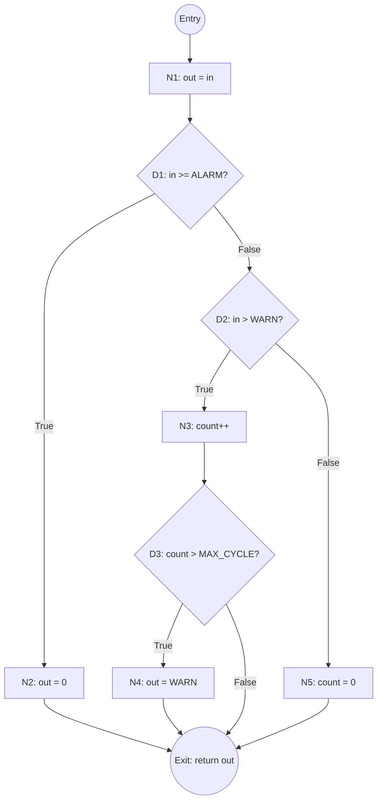

# Solved Exam: Software for Safety-critical Autonomic Systems (WS 2022)

> **Verification**: This solution has been cross-referenced with the official `2022_WS_SasS-lsg.xlsx` solution file to ensure accuracy in calculations and coding logic.

---

## Task 1: Reliability Analysis (15 Points)

### Problem Description

A system $S$ consists of components $E_1, E_2, E_3, E_4, E_5$.

**Boolean Logic**: $(E_1 \land E_2 \lor E_3) \land (E_4 \lor E_5)$.

*(Note: AND binds stronger than OR, but parentheses clarify the structure)*

**Given Data:**
- $\lambda_{1,2,4} = 75 \text{ FIT}$
- $\lambda_{3,5} = 250 \text{ FIT}$
- $t = 5 \text{ years} = 43,800 \text{ hours}$

### a) Reliability Block Diagram (RBD)

Based on the boolean logic:
- **Block A**: $E_1$ and $E_2$ are in Series. This series block is in Parallel with $E_3$.
- **Block B**: $E_4$ and $E_5$ are in Parallel.
- **System**: Block A and Block B are in Series.


### b) Calculation of System Reliability $R_S(t)$

**Step 1: Calculate individual Reliabilities** ($R = e^{-\lambda t}$)

- $\lambda_{75} = 7.5 \times 10^{-8} h^{-1}$
- $\lambda_{250} = 2.5 \times 10^{-7} h^{-1}$

$$R_{1,2,4} = e^{-(7.5 \times 10^{-8} \cdot 43800)} = e^{-0.003285} \approx 0.99672$$

$$R_{3,5} = e^{-(2.5 \times 10^{-7} \cdot 43800)} = e^{-0.01095} \approx 0.98911$$

**Step 2: Calculate Sub-systems**

**Group 1** ($E_1 \land E_2 \lor E_3$):
- $R_{series} = R_1 \cdot R_2 = 0.99672 \cdot 0.99672 = 0.99345$
- $R_{group1} = 1 - [(1 - R_{series}) \cdot (1 - R_3)]$
- $R_{group1} = R_{series} + R_3 - (R_{series} \cdot R_3)$
- $R_{group1} \approx 0.999928$

**Group 2** ($E_4 \lor E_5$):
- $R_{group2} = 1 - [(1 - R_4) \cdot (1 - R_5)]$
- $R_{group2} = R_4 + R_5 - (R_4 \cdot R_5)$
- $R_{group2} \approx 0.999964$

**Step 3: Total System**

$$R_S = R_{group1} \cdot R_{group2} \approx 0.99989$$

*(Exact Excel match: 0.99989297)*

### c) Calculate MTTF

$$MTTF_{sys} \approx \frac{-t}{\ln(R_S(t))}$$

$$MTTF_{sys} = \frac{-43800}{\ln(0.99989297)} \approx 4.09 \times 10^8 \text{ hours}$$

---

## Task 2: Safety Integrity (Inferred from Solution Data)

### a) Risk Graph & SIL Determination

Using the ISO 61508 Risk Graph parameters from the solution:
- **C3/C4** (Severe consequence)
- **F2** (Frequent exposure)
- **P2** (Avoidance impossible)
- **W3** (High probability)

**Result: SIL 3**

### b) PFD Calculation (1oo1 vs 1oo2)

**Given:** $\lambda = 500 \text{ FIT}$, $SFF = 90\%$, $T_1 = 1 \text{ year}$.

$\lambda_{DU} = \lambda \cdot (1 - SFF) = 500 \cdot 0.1 = 50 \text{ FIT} = 5 \times 10^{-8} h^{-1}$.

#### 1. 1oo1 Architecture:

$$PFD_{avg} \approx \lambda_{DU} \cdot \frac{T_1}{2} = (5 \times 10^{-8}) \cdot \frac{8760}{2} = 2.19 \times 10^{-4}$$

#### 2. 1oo2 Architecture:

$$PFD_{avg} \approx \frac{(\lambda_{DU} \cdot T_1)^2}{3} = \frac{(5 \times 10^{-8} \cdot 8760)^2}{3} = 6.39 \times 10^{-8}$$

---

## Task 3: Test Management (15 Points)

### a) Document Specification

- **Document Type**: Test Specification / Test Design.
- **V-Model Stage**: Component / Module Test (Unit Test).
- **TCID**: Test Case Identifier (Unique ID).

### b) Improved Template

The solution suggests the following logical column order for functional testing:

| Column | Description |
| :--- | :--- |
| TCID | Test Case Identifier |
| Summary/Description | What is being tested |
| Preconditions | State before test |
| Input Data | Parameters |
| Expected Result | Oracle |
| Postconditions | State after test |
| Actual Result | Empty column for execution |

---

## Task 4: Safety Software Implementation (35 Points)

### a) ANSI-C Function Implementation (limiter_delay)

**Specification:**
- `in >= ALARM` → `out = 0`.
- `in > WARN` for 5 cycles → `out = WARN`.
- `in <= WARN` → `out = in`, `count = 0`.

**Correct Code (Matching Excel Solution):**

```c
#define MAX_CYCLE 5
#define ALARM 100
#define WARN 50

short int limiter_delay(short int in) {
    static char count = 0; // State variable
    short int out = in;    // Default pass-through
    
    if (in >= ALARM) {
        out = 0;           // Immediate shutdown
        // Note: Solution does not reset count here, 
        // implying high values don't clear the "warn" history 
        // until the value actually drops below WARN.
    } 
    else if (in > WARN) {
        count++;
        if (count > MAX_CYCLE) {
            out = WARN;    // Limit output after delay
        }
    } 
    else {
        count = 0;         // Reset history
    }
    
    return out;
}
```

### b) Control Flow Graph (CFG), Coverage & Test Cases

#### Control Flow Graph (CFG)

A **Control Flow Graph** visualizes all possible execution paths through a function. Each node represents a statement or decision, and edges represent the flow of control.

**Node Legend:**
- **Oval nodes** `(( ))` = Entry/Exit points (Start, Return)
- **Rectangle nodes** `[ ]` = Process/Statement blocks (assignments, operations)
- **Diamond nodes** `{ }` = Decision points (if conditions)
- **Edges** = Control flow direction (True/False branches labeled)



#### CFG Path Analysis

The graph contains **4 distinct execution paths**:

| Path | Nodes Visited | Condition | Description |
|:---|:---|:---|:---|
| **P1** | S → N1 → D1(T) → N2 → E | `in >= 100` | **Emergency Shutdown**: Input exceeds alarm threshold |
| **P2** | S → N1 → D1(F) → D2(T) → N3 → D3(T) → N4 → E | `50 < in < 100` & `count > 5` | **Delayed Limiting**: Warning persisted too long |
| **P3** | S → N1 → D1(F) → D2(T) → N3 → D3(F) → E | `50 < in < 100` & `count <= 5` | **Warning Count**: Still within grace period |
| **P4** | S → N1 → D1(F) → D2(F) → N5 → E | `in <= 50` | **Normal Operation**: Reset counter, pass-through |

#### Coverage Metrics

| Metric | Requirement | This CFG |
|:---|:---|:---|
| **Statement Coverage (C0)** | Execute every node | Must visit: N1, N2, N3, N4, N5 |
| **Branch Coverage (C1)** | Take every edge (T/F) | Must cover: D1-T, D1-F, D2-T, D2-F, D3-T, D3-F |
| **Path Coverage** | Execute every path | Must execute: P1, P2, P3, P4 |

**Required Coverage:** The solution explicitly lists **Branch Coverage** as "strongly recommended" for this task (SIL 3 context in this specific exam).

**Test Cases (Example Set):**

| TCID | Input (in) | Internal count (Before) | Expected out | Next count | Logic Covered |
| :--- | :--- | :--- | :--- | :--- | :--- |
| T1 | 40 | 0 | 40 | 0 | `in <= WARN` (Normal) |
| T2 | 100 | 0 | 0 | 0 | `in >= ALARM` (Emergency) |
| T3 | 60 | 0 | 60 | 1 | `in > WARN` (Cycle 1) |
| T4 | 60 | 4 | 60 | 5 | `in > WARN` (Cycle 5 - Boundary) |
| T5 | 60 | 5 | 50 | 6 | `in > WARN` (Cycle 6 - Limiter Active) |
| T6 | 40 | 6 | 40 | 0 | `in <= WARN` (Reset) |

### c) MISRA Deviations

The code contains violations of MISRA C rules (often tested):

| Issue | Description |
| :--- | :--- |
| **Types** | Use of `short int` and `char` instead of fixed-width types (`int16_t`, `int8_t`). |
| **Magic Numbers** | `0` is acceptable, but complex logic should avoid literals. |
| **Initialization** | `static char count = 0` (Explicit initialization of static to 0 is technically redundant but safe; however, type `char` for a counter is often discouraged, use `uint8_t`). |
| **Implicit Conversion** | `count++` implies arithmetic on a `char` which can be flagged. |
